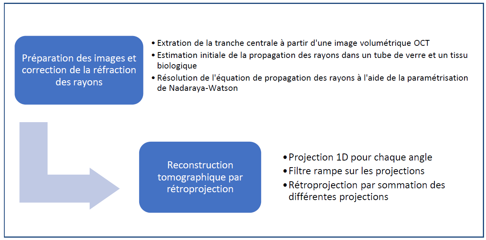

# Optical coherence refraction tomography

*Reproduction de la methode OCRT pour le projet de 4eme annee de baccalaureat Polytechnique Montreal.*
* **Papier original**: https://www.nature.com/articles/s41566-019-0508-1
* **Nature Supplementary Materials**: [PDF](https://static-content.springer.com/esm/art%3A10.1038%2Fs41566-019-0508-1/MediaObjects/41566_2019_508_MOESM1_ESM.pdf)
* **Code original**: https://github.com/kevinczhou/optical-coherence-refraction-tomography

## Description algorithme


## Data
Les images de test peuvent etre trouve dans le dossier: "/data"
## Code
The code depends on the following libraries:
- tensorflow (the CPU version is sufficient)
- numpy
- scipy
- opencv
- matplotlib
- jupyter

## Comment debuter
1) Clone this GitHub repository on your computer:
```bash
git clone https://github.com/PaulBautin/optical-coherence-refraction-tomography.git
cd optical-coherence-refraction-tomography
```
- For Windows user, you might need to [install git](https://git-scm.com/downloads) prior to clone the repository.

2) Run the following to create a virtual environment and start the notebook:

```bash
conda env create -f environment.yml # Only do it once in order to create the environment (might take a few minutes)
```

- Make sure that your prompt is currently on the `optical-coherence-refraction-tomography` folder when you call the `environment.yml` file.
- For Windows user, you might need to type these commands in `Anaconda Prompt` if `cmd` does not recognize `conda`.

**Make sure that you have the last version of the files by pulling the repo before every new lab** (`git pull`).

## Execution
Le code a ete execute avec python 3.6

## Citation
If you find our code and/or datasets useful to your research, please cite the following publication:

Zhou, K. C., Qian, R., Degan, S., Farsiu, S., & Izatt, J. A. Optical coherence refraction tomography. *Nature Photonics*, 13(11), 794-802 (2019).

