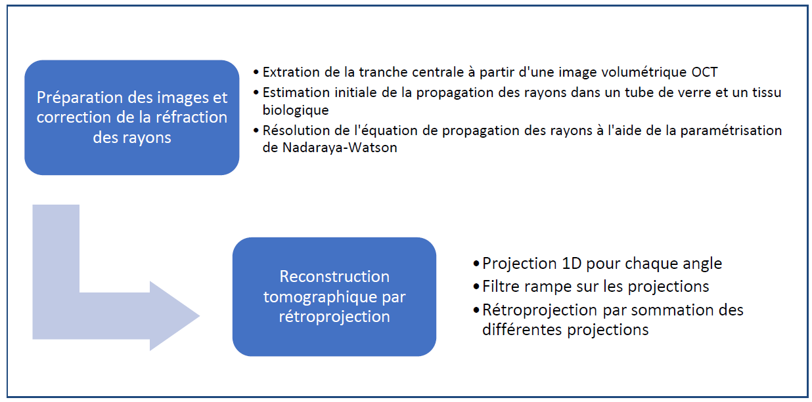

# Optical coherence refraction tomography

*Reproduction de la méthode OCRT pour le projet de 4ᵉ année de baccalauréat : GBM8970 - Projet intégrateur de génie biomédical. Polytechnique Montréal.*
* **Papier original** : https://www.nature.com/articles/s41566-019-0508-1
* **Nature Supplementary Materials** : [PDF](https://static-content.springer.com/esm/art%3A10.1038%2Fs41566-019-0508-1/MediaObjects/41566_2019_508_MOESM1_ESM.pdf)
* **Code original** : https://github.com/kevinczhou/optical-coherence-refraction-tomography

## Data
Les images sont trop volumineuses pour être directement téléchargées sur Github (limite > 100 Mo)

## Comment débuter
1) Si ce n'est pas deja fait installez [miniconda](https://docs.conda.io/en/latest/miniconda.html) ou conda sur votre ordinateur
2) Ouvrir miniconda prompt et cloner le dépôt GitHub dans le dossier de votre choix :
```bash
git clone https://github.com/PaulBautin/optical-coherence-refraction-tomography.git ocrt
cd ocrt
```
- Les utilisateurs Windows, auront probablement besoin d'installer git avant de cloner le dépôt avec la commande : `conda install -c anaconda git`

3) Exécutez la commande suivante pour installer les packages nécessaires :

```bash
pip install -e . # Ne faire cette étape qu'une seule fois (peut prendre quelques minutes)
```
- Assurez-vous d'etre dans le dossier `ocrt` lorsque vous exécutez la commande ci-dessus.

**Pour être sûr que vous avez toujours la dernière version des fichiers, assurez-vous de toujours lancer la commande (`git pull`) avant chaque utilisation.

## Exécution
Le code a été exécuté avec python 3.8. Voici les informations importantes pour faire tourner le script principal *image_correction.py*
```bash
usage: image_correction [-h] -i I [-fig] [-o O] [-l]

Algorithme de correction des distorsions liées aux changements d'indices de réfractions.

optional arguments:
  -h, --help  show this help message and exit

MANDATORY ARGUMENTS:
  -i I        Path to folder that contains input images. Example: "octr_data"

OPTIONAL ARGUMENTS:
  -fig        Generate figures
  -o O        Path where figures will be saved. By default, they will be saved in the current directory.
  -l          manually find borders of capillary
```
## Livrables
* Mandats :
  [GBM8970_P5_OCTTomo](data/GBM8970_P5_OCTTomo.pdf)
* Document de spécifications :
  [GBM8970-P5OCT.SpecFonc](data/GBM8970-P5OCT.SpecFonc.pdf)
* Document de design :
[GBM8970-P5OCT.Design](data/GBM8970-P5OCT.Design.pdf)

## Description de l'algorithme

